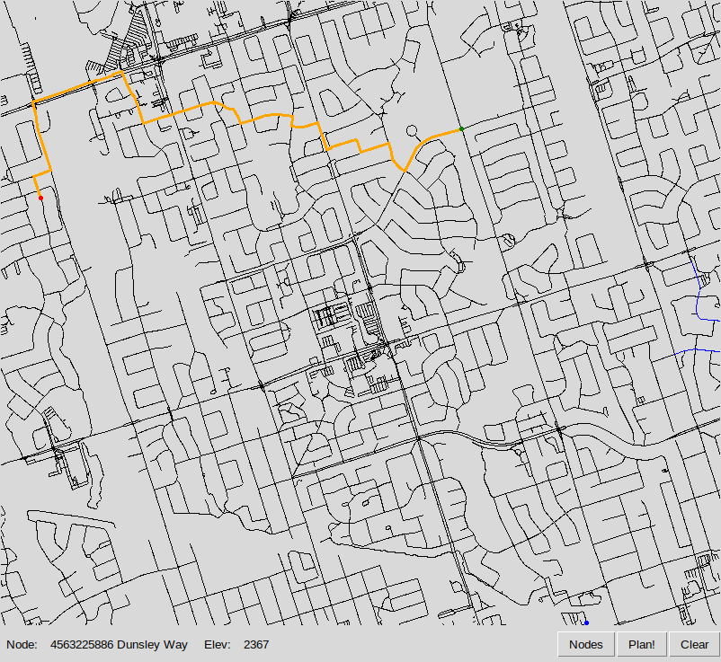
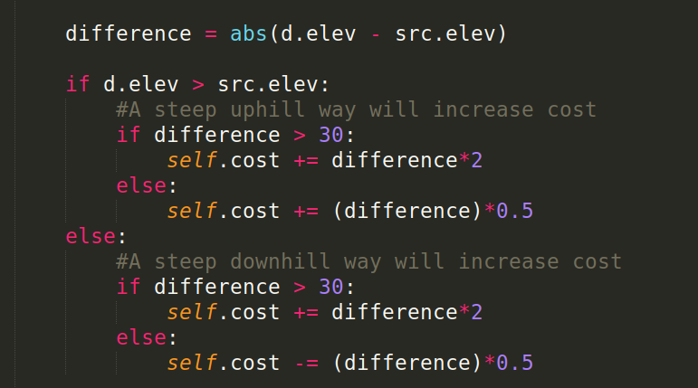
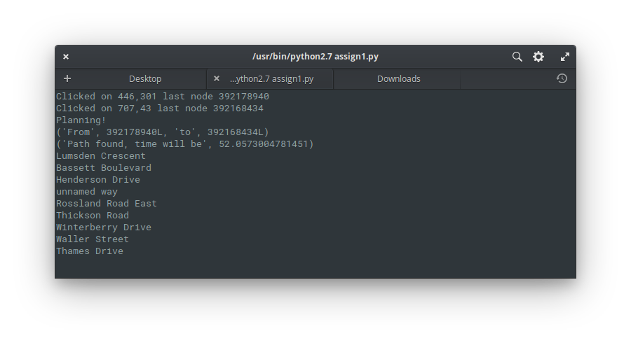
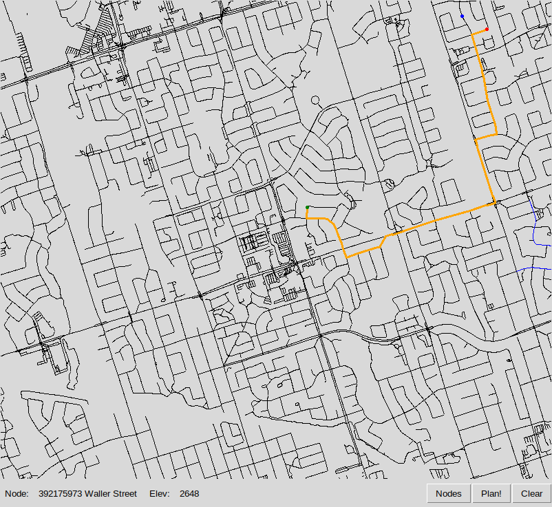
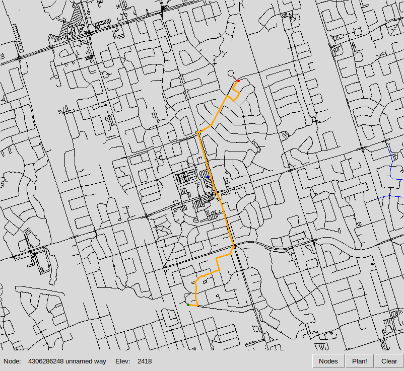
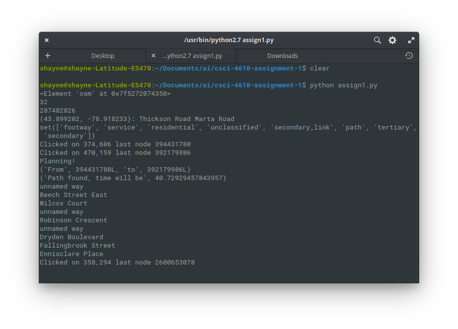
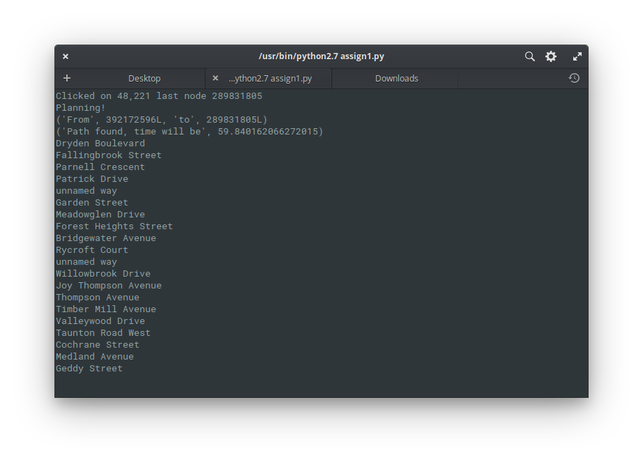

# CSCI-4610 Artifical Intelligence: Assignment 1
Group Members:
- Jude Arokiam
- Mitchell Childerhose
- Shayne Taylor

_NOTE: All group work was equally distributed through group meetings and pair programming. Commit log is not a good representation of work done._

## Overview
Uses A* algorithm to find the shortest path between two locations in the town of Whitby.

## Heuristic and Cost Function
### Heuristic
The heuristic function has not been changed from the starter code. This is because we have combined the cost and heuristic together.

### Cost Function
For every edge we compute the difference in distance as well as elevation. The cost is initialized as the absolute distance between nodes. If the destination node elevation is greater than the starting node then we can consider this as walking "up hill". The cost will increase due to it being physically more difficult. We have created a threshold value to account for cases where the change in elevation is very small or very large. Similarly, when the destination node elevation is less than the starting node, the cost will decrease since walking "down hill" is less work. The same threshold value is used when the incline is very steep and results in the cost increasing.

## Screenshots
### Experiment 1

### Experiment 2

### Experiment 3

